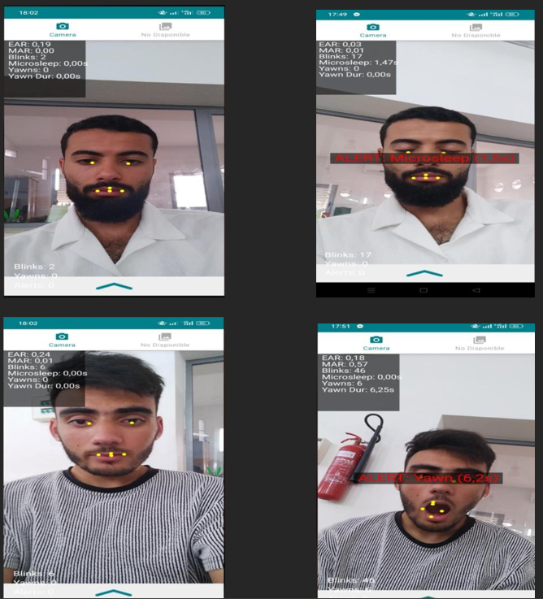

# Real-time Driver Drowsiness Detection App

---

## 🚨 Problem Statement

According to Stadies , drowsiness at the wheel causes around 20% of fatal road accidents in Europe. Traditional solutions such as self-assessment or physical sensors are limited.

---

##  Proposed Solution

A mobile application using the **front camera** to detect signs of drowsiness such as **eye closure** and **yawning** via **MediaPipe** and **EAR/MAR algorithms**, issuing real-time alerts.

---

##  Methodology

### What is Needed?

- Access to a front-facing camera
- Detection of facial landmarks
- Eye Aspect Ratio (EAR) and Mouth Aspect Ratio (MAR) calculations

### How Drowsiness is Detected

- Monitor EAR and MAR values over time.
- If eyes or mouth stay closed/open beyond thresholds, trigger an alert.

#### Key Formulas

- **EAR (Eye Aspect Ratio):** Detects prolonged eye closure
- **MAR (Mouth Aspect Ratio):** Detects yawning
- If EAR < threshold for X frames → microsleep detected
- If MAR > threshold for Y frames → yawn detected

---

##  Tools and Frameworks

- **MediaPipe Face Landmarker**
- **Android Studio**
- **Kotlin (PermissionsFragment.kt, CameraFragment.kt, etc.)**

---

##  Application Architecture

- **PermissionsFragment.kt** – Manages camera permissions
- **CameraFragment.kt** – Captures camera frames
- **FaceLandmarkerHelper.kt** – Core logic for EAR/MAR detection
- **OverlayView.kt** – Displays facial landmarks and alerts
- **MainViewModel.kt** – Manages state and stats

---

##  Data Flow

1. App starts → asks for camera permission
2. On approval → camera starts in `CameraFragment.kt`
3. Frames go to `FaceLandmarkerHelper` → EAR/MAR computed
4. If drowsiness is detected → alert displayed on `OverlayView.kt`
5. Stats persist via `MainViewModel.kt`

---

##  Customization

The user can adjust:
- EAR/MAR thresholds
- Alert sensitivity based on personal facial features

---

##  Results

- Real-time video processing
- Accurate EAR/MAR calculations
- Customizable thresholds
- Clear visual feedback
- Reliable state management

---

##  Live Demonstration

---

## 🧾 Final Conclusion

This project proves that a **smartphone-based** vision system is a viable, cost-effective alternative to expensive in-vehicle systems. It democratizes road safety tech by using only a phone and open-source tools.

> “Real-time App Driver Drowsiness Detection” is a step forward in making roads safer for everyone.

---
